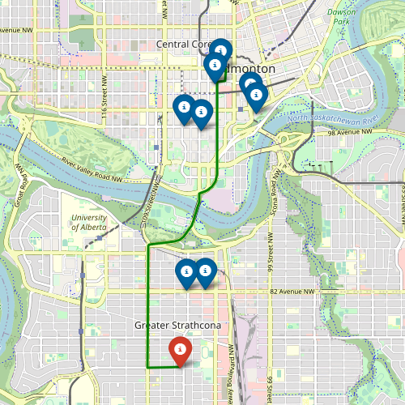

<div align="center">





# City Explorer


</div> 

## Contents
* [About](#about)
* [Packages](#packages)
* [References](#references)
* [Specifications](#specifications)
* [Installation](#installation)
* [Usages](#usages)
* [Notes](#notes)

<a name="about"></a>
## About
City Explorer - Interactive Tourism Map with Routing Functionality  
- Developed full stack web application using Django framework with OpenStreetMap API, Nominatim geocoding, Overpass API for real-time filtering and visualization of tourist attractions.  
- Utilized OpenRouteService API to enable users to input multiple locations and generate optimized routes, exploring attractions efficiently.  
- User-friendly and dynamically interactable interface with Bootstrap 4, Django Crispy Forms, and Folium powered map.  


<a name="packages"></a>
## Packages  
### <ins>Front-end</ins>
- Bootstrap 4.
- Django Crispy Forms .
- Folium.
- HTML.
### <ins>APIs</ins>
- Nominatim.
- OpenRouteService.
- OpenStreetMap.
- Overpass.
### <ins>Back-end</ins>
- SQLite3.

<a name="references"></a>
## References
- OpenRouteService [VROOM API](https://github.com/VROOM-Project/vroom/blob/master/docs/API.md).

<a name="specifications"></a>
## Specifications
### <ins>Marker</ins>
- #### Description:   
Stores a collection of markers for a specific city for placing on the map.  
- #### Fields:  
```city```: The name of the city (CharField with maximum length of 100 characters, nullable).  
```places```: A JSONField that stores information about places associated with the marker. Default value is an empty dictionary.  
### <ins>Search</ins>
- #### Description:   
Represents a search query for a city, including specific categorical point of interest filters.  
- #### Fields:  
```city```: The name of the city (CharField with maximum length of 100 characters, nullable).  
```documented```: A field representing if the location has a website documentation (Boolean).  
```tourism_filters```: A field to store specific categorical point of interest filters for the search (CharField with maximum length of 100 characters, nullable).  
```marker```: A foreign key relationship to the Marker model, representing the associated marker for the search. It uses the CASCADE deletion behavior, nullable.
### <ins>Address</ins>
- #### Description:  
Represents an address where user stays.
- #### Fields:  
```address```: The street address (CharField with maximum length of 500 characters, nullable).
### <ins>Path</ins>
- #### Description:  
Represents a path to draw and optimize, defined by the user.
- #### Fields:  
```paths```: The path value (CharField with maximum length of 500 characters, nullable).  
```query```: A JSONField to store query information associated with the path. Default value is an empty list.

<a name="installation"></a>
## Installation
```
python3 -m venv venv
source env/bin/activate
pip install -r requirements.txt
```

<a name="usages"></a>
## Usages
- In ```cityexplorer/``` execute ```python manage.py runserver```.  
- In browser, go to ```localhost:8000```.
- ```zNone``` modifier: clear all markers.
- Start path with ```0```: disable path optimization.
- Start path with ```-1```: start from a marker.
- Enter marker's index for path optimization.

<a name="notes"></a>
## Notes
- Default data is in fixtures.
- <ins>Add</ins>: Street view maybe.
